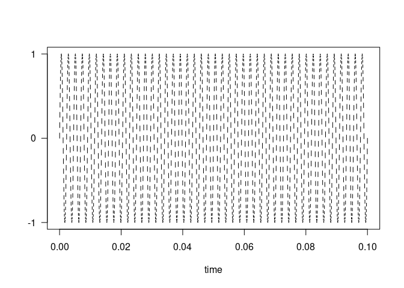
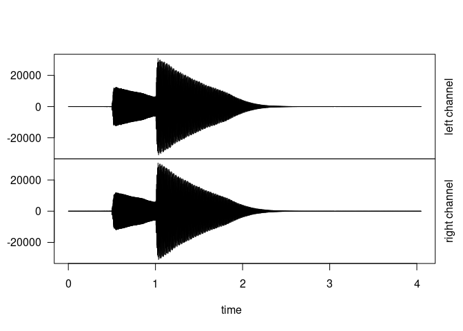
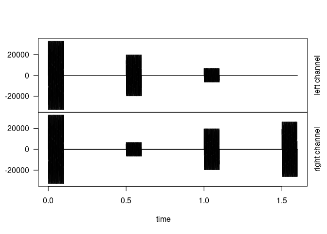
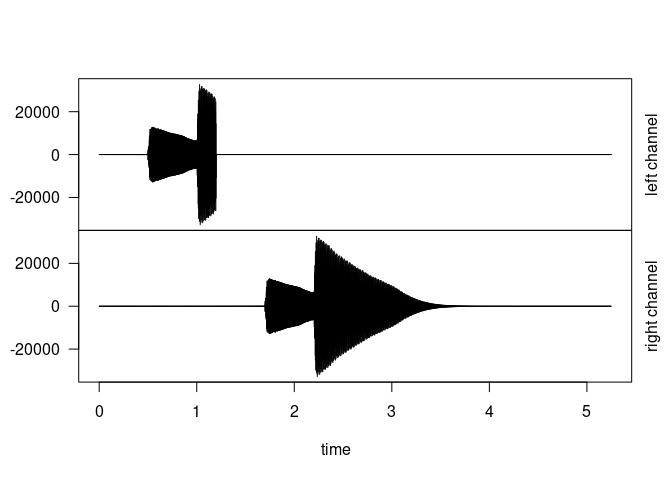

-   [Introduction](#introduction)
-   [Basics: sound samples, sequencing and
    mixing.](#basics-sound-samples-sequencing-and-mixing.)
    -   [Sound sample](#sound-sample)
        -   [Properties](#properties)
        -   [Creating a sound sample from
            scratch](#creating-a-sound-sample-from-scratch)
        -   [Transforming a data series into a sound
            sample](#transforming-a-data-series-into-a-sound-sample)
        -   [Reading a sound sample from an audio
            file](#reading-a-sound-sample-from-an-audio-file)
    -   [Sequencing and mixing](#sequencing-and-mixing)
        -   [Creating a sequence](#creating-a-sequence)
        -   [Mixing sequences](#mixing-sequences)
-   [Application to data sonification: the Wagga Wagga
    Groove](#application-to-data-sonification-the-wagga-wagga-groove)
    -   [General principles](#general-principles)
    -   [Sonification of the Wagga Wagga
        dataset](#sonification-of-the-wagga-wagga-dataset)
-   [Other tools](#other-tools)
    -   [Instruments](#instruments)
    -   [Synthesizers](#synthesizers)
    -   [Effects](#effects)
    -   [Pre-built sonifications](#pre-built-sonifications)

# Introduction

A [sequencer](https://en.wikipedia.org/wiki/Music_sequencer) is a device
or software for creating musical pieces by editing and combining sound
samples. The aim of this package is to provide a minimalistic R-based
implementation of the most basic actions typically performed by a
sequencer, in particular:

1.  Creating **sound samples**.
2.  **Sequencing**, i.e. creating a musical sequence by repeating a
    given sound sample according to some rythmic pattern.
3.  **Mixing**, i.e. merging several sequences into a single musical
    piece.

While this package is quite rudimentary compared with existing
[sequencers](https://en.wikipedia.org/wiki/List_of_music_sequencers), it
allows using the R language for automating some of these steps, which is
particularly useful for data
[sonification](https://en.wikipedia.org/wiki/Sonification), as will be
illustrated in this vignette (with more examples available in [this
blog](https://globxblog.github.io/)).

The package `sequenceR` strongly builds on the package `tuneR`, and both
packages generally need to be loaded:

    library(sequenceR)
    library(tuneR)

# Basics: sound samples, sequencing and mixing.

## Sound sample

### Properties

A `soundSample` is an object containing the following attributes:

1.  the [waveform](https://en.wikipedia.org/wiki/Waveform) `wave`,
    normalized to be smaller than 1 in absolute value.
2.  the `duration` of the sample in seconds.
3.  the sampling `rate`, in number of values per second.
4.  the number of values in the waveform `n`, equal to
    `rate`\*`duration`.

Let’s now see three possible ways to create a `soundSample` object.

### Creating a sound sample from scratch

A 0.1-second A note can be created by using a sine wave as shown below:

    # a 0.1-second A note
    d <- 0.1 # duration of the sample in seconds
    rate <- 44100 # sampling rate in values per second (this is a typical value and is used as a default throughout this package)
    n <- round(rate*d) # number of values in the waveform
    w <- sin(2*pi*440*seq(0,d,length.out=n)) # waveform (440Hz A note)
    A <- soundSample(wave=w,rate=rate) 

The package provides two methods to `plot` and `listen` to the created
`soundSample` object:

    # listen(A) # uncomment to listen to the sample
    plot(A) # plot the sample

The second example below adds some noise to this perfect A note. For
more approaches to generate sound, see [sound
synthesis](https://en.wikipedia.org/wiki/Synthesizer#Sound_synthesis).

    noisyA <- soundSample(wave=w+0.1*rnorm(n))
    # listen(noisyA) # uncomment to listen to the sample
    plot(noisyA)

### Transforming a data series into a sound sample

Instead of generating a sound from mathematical functions, it is
possible to use an existing data series and to interpret it as a
waveform as shown in the example below. This works better with
relatively long series showing some form of seasonality.

    sun <- soundSample(sunspots,rate=44100/10) # sampling rate is lowered to get a low pitch
    # listen(sun) # uncomment to listen to the sample
    plot(sun)

### Reading a sound sample from an audio file

A `soundSample` object can also be created by reading an existing audio
file (typically a .wav or .mp3). Functions such as `readWave` and
`readMP3` are provided by the `tuneR` package for this purpose. The
example below shows how to read a ‘ding-dong’ mp3 file, downloaded from
the [BBC website](https://sound-effects.bbcrewind.co.uk/search). You can
find more sources of audio sound samples on this
[website](https://wiki.laptop.org/go/Free_sound_samples).

    w <- tuneR::readMP3(file.path('vignettes','07027201.mp3'))
    tuneR::plot(w)

Note that the `readWave` function returns a `Wave` object (from package
`tuneR`), which needs to be turned into a `soundSample` object (from
package `sequenceR`). This can easily be done as shown below. Comparing
the plots above and below illustrates the main differences between
`Wave` and `soundSample` objects: (1) the latter is mono, while the
former may be stereo; (2) the latter is standardized so that its maximum
absolute value is one.

    # Cast Wave to sound Sample 
    sam <-as.soundSample(w)
    # listen(sam) # uncomment to listen to the sample
    plot(sam)

## Sequencing and mixing

### Creating a sequence

The `sequence` function repeats a `soundSample` at specific times (given
in seconds). It is also possible to specify the volume (standardized
between 0 and 1) at which each repetition is played, along with its
panoramic (-1 for full left to 1 for full right, 0 is centered). The
example below illustrates this. Note that the output of the `sequence`
function is a stereo `Wave` object.

    A_seq <- sequence(A,time=c(0,0.5,1,1.5),
                      volume=c(1,0.4,0.4,0.4),
                      pan=c(0,-0.5,0.5,1))
    tuneR::plot(A_seq)

The code below creates a second sequence using the sample read from the
BBC website, and illustrate the effect of the option `letRing`.

    sam_seq <- sequence(sam,time=c(0,1.2),pan=c(-1,1),letRing=FALSE)
    tuneR::plot(sam_seq)

    sam_seq <- sequence(sam,time=c(0,1.2),pan=c(-1,1),letRing=TRUE)
    tuneR::plot(sam_seq)

### Mixing sequences

The `mix` function takes several `Wave` objects as inputs
(e.g. sequences resulting from calls to the `sequence` function) and
merges them into a single `Wave` object. It allows controlling the
volume and the panoramic of each sequence.

    myMix <- mix(list(A_seq,sam_seq),volume=c(1,0.3))
    # tuneR::play(myMix) # uncomment to play
    # tuneR::writeWave(myMix,'myMix.wav') # uncomment to save to disk
    tuneR::plot(myMix)

# Application to data sonification: the Wagga Wagga Groove

## General principles

Data [sonification](https://en.wikipedia.org/wiki/Sonification) refers
to the transformation of data into sound, using some algorithmic
process. This can be achieved in [many
ways](https://sonification.de/handbook/), but here we focus on the
approach known as [*parameter
mapping*](https://sonification.de/handbook/chapters/chapter15/): the
values taken by the data are mapped into some attributes (or parameters)
of notes, typically their pitch or loudness, or possibly their duration.
This is very much the same process as the mapping performed in data
visualization, where data values are mapped into e.g. the color, size of
type of symbols in a graph or map.

One possible sonification process is to use data to control the
sequencing of a sound sample. Consider, as an example, the Wagga Wagga
dataset which comes with this package. It contains the annual
precipitation and temperature time series in the city of Wagga Wagga,
New South Wales, Australia, as plotted below. A possible sonification of
this dataset is to use the data to control the elements of a drum. For
instance, a low kick might be played whenever the precipitation is low,
and a snare whenever it is high; in addition the temperature might be
used to control the master volume. The use of `sequenceR` to achieve
this is described next.

    plot(WaggaWagga$Year,WaggaWagga$Precipitation,type='l',xlab='Year',ylab='precip. [mm]')

    plot(WaggaWagga$Year,WaggaWagga$Temperature,type='l',xlab='Year',ylab='temp. [C]')

## Sonification of the Wagga Wagga dataset

We start by defining a few properties of this sonification attempt: its
duration, the times at which sound samples will be played and the master
volume, controlled by the temperature time series.

    n <- NROW(WaggaWagga) # series size
    dur <- 9 # duration in seconds
    tim <- dur*seq(0,1,length.out=n) # regular time vector between 0 and dur
    master <- rescale(WaggaWagga$Temperature,0.2,1) # master volume = temperature time series rescaled between 0.2 and 1

We are going to use three basic elements of a drum: a hi-hat, a bass
drum and a snare. The corresponding `soundSample` objects `hiHat`,
`kick` and `snare` come along with this package so that we can directly
proceed to the sequencing.

We start by defining a hi-hat rhythmic pattern by playing groups of four
notes, the first one being accentuated. This is a typical pattern (very
much similar to [this
intro](https://www.youtube.com/watch?v=Q429AOpL_ds)) and it allows
installing the rhythmic pulse.

    every4=(((1:n)-1))%%4==0 # T F F F T F F F etc.
    accents <- rescale(as.numeric(every4),0.2,1) # 1 0.2 0.2 0.2 1 0.2 0.2 0.2 etc.  
    hh <- sequence(hiHat,time=tim,volume=master*accents) # create hi-hat sequence
    # tuneR::play(hh) # uncomment to play

We then define the low kick sequence by playing it every time
precipitation is lower than some threshold.

    mask=WaggaWagga$Precipitation<450 # time steps with low pp
    k <- sequence(kick,time=tim[mask],volume=master[mask]) # play a kick at those time steps
    # tuneR::play(k) # uncomment to play

We proceed in a similar way to associate the snare with high
precipitation values.

    mask=WaggaWagga$Precipitation>800 # time steps with high pp
    s <- sequence(snare,time=tim[mask],volume=master[mask]) # play a snare at those time steps
    # tuneR::play(s) # uncomment to play

The final step is to mix the hi-hat, kick and snare sequences together
and to save the result to a file.

    final <- mix(list(hh,k,s),volume=c(0.5,0.75,1))
    writeWave(final,'WaggaWagga.wav') # write to disc
    # tuneR::play(final) # uncomment to play

Data sonification is particularly interesting when it is combined with
data animation, as shown in the example below based on the package
[gganimate](https://gganimate.com/index.html). The resulting video can
be seen [here](https://vimeo.com/411936619).

    library(tidyr);library(ggplot2);library(gganimate)
    # Modify the shape of the WaggaWagga dataset to facilitate plotting
    DF <- pivot_longer(WaggaWagga,-Year) # function from tidyr
    # Plot precipitation and temperature time series using ggplot
    g <- ggplot(DF,aes(x=Year,y=value))
    g <- g + geom_line(aes(color=name),linewidth=1)+geom_point(size=4)
    g <- g + scale_color_manual(values = c('blue','red'),guide=FALSE)
    g <- g + facet_wrap(vars(name),ncol=1,scales='free_y')+theme_bw()
    g <- g + geom_hline(data=data.frame(y=450,name='Precipitation'),aes(yintercept=y))
    g <- g + geom_hline(data=data.frame(y=800,name='Precipitation'),aes(yintercept=y))
    # Make it look nicer
    g <- g+theme_bw()+theme(axis.title=element_text(size=18), 
              axis.text=element_text(size=14),
              strip.text=element_text(size=18))
    # Create an animated plot
    g <- g + transition_reveal(Year)
    # 'Render' the animated plot into a .mp4 movie
    fps=n/dur # number of frames divided by duration
    animate(g,nframes=NROW(WaggaWagga),fps=fps,width=1280,height=720,
            renderer = av_renderer('WaggaWaggaGroove.mp4',audio='WaggaWagga.wav'))

# Other tools

## Instruments

An `instrument` object is simply a named list of `soundSample`’s. For
instance, a simple drum kit can be assembled using the `kick`, `snare`
and `hiHat` `soundSample`’s that come with the package. The instrument
can then be played using the `play.instrument` function, which is mostly
an extension of the `sequence` function to allow selecting notes:

    drums <- instrument(samples=list(kick,snare,hiHat),notes=c('boom','tat','cheet'))
    w=play.instrument(drums,notes=rep(c('boom','cheet','tat','cheet'),4),
                      time=0.25*(0:15),volume=(1:16)/16,
                      pan=rep(c(0,-0.5,0.5,-0.5),4))
    # tuneR::play(w) # uncomment to play
    tuneR::plot(w)

Instruments are very useful to implement data sonification: many
examples can be found in [this blog](https://globxblog.github.io/) (with
corresponding codes [here](https://github.com/globXblog/scripts)). It is
possible to build your own instruments using the many sample packs that
can be downloaded from the internet (not for free in general). On [this
page](https://github.com/benRenard/sequenceR/tree/main/data-raw/samplePacks)
you will find several links to freely-available packs, generally under
an “attribution” creative commons license. [This
file](https://github.com/benRenard/sequenceR/blob/main/data-raw/samplepack2instrument.R)
can be used to build the instrument from downloaded packs.

## Synthesizers

The package provides a few basic tools for sound synthesis: oscillator
utilities (see `?oscillator` and `?oscillator_pattern`) and a basic
synthesizer:

    # Create a synthesizer instrument and play it
    synth <- getSynth(c('E2','B2','E3','G3','A3')) 
    w=play.instrument(synth,time=(0:(length(synth)-1))*0.5,fadeout=rep(Inf,length(synth)))
    # tuneR::play(w) # uncomment to play
    tuneR::plot(w)

## Effects

The package provides a few basic effects:
[envelopes](https://en.wikipedia.org/wiki/Envelope_(music)), distortion
and delay:

    dry=oscillator(freq=110,duration=1) # a low A note
    # Define an ADSR envelope (https://en.wikipedia.org/wiki/Envelope_(music)#ADSR)
    env <- envelope(t=c(0,0.05,0.2,0.8,1),v=c(0,1,0.6,0.2,0))
    plot(env)

    # Apply effects: envelope, saturation and delay
    w1=applyEnvelope(dry,env)
    w2=applyDisto(w1,type='clip',level=0.5)
    wet=applyDelay(w2,delayTime=0.5,echoes=1/(1:5))
    # listen(wet) # uncomment to play
    plot(wet)

The piping syntax of `dplyr` is quite useful for chaining effects:

    library(dplyr)
    wet=dry %>% applyEnvelope(env) %>% applyDisto(type='clip',level=0.5) %>%
      applyDelay(delayTime=0.5,echoes=1/(1:5))
    # listen(wet) # uncomment to play
    plot(wet)

## Pre-built sonifications

The package provides a pre-built sonification of the famous [warming
stripes](https://en.wikipedia.org/wiki/Warming_stripes): this allows
using your own data, playing with musical options, and digging into the
code to see how the tools provided by the package can be pieced together
to create music out of data.

    w=sonifyStripes(videoFile='stripes.mp4')
